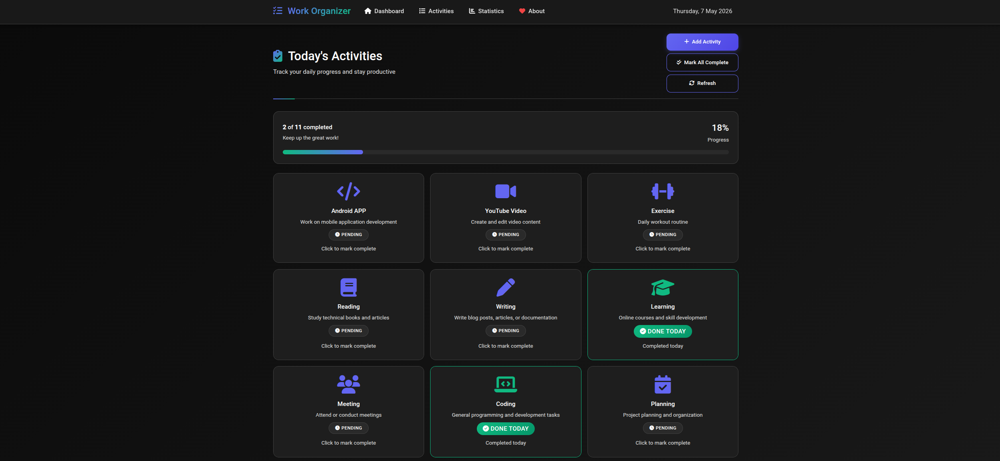
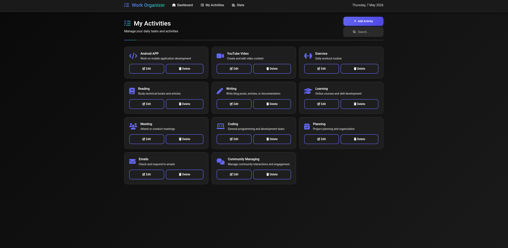
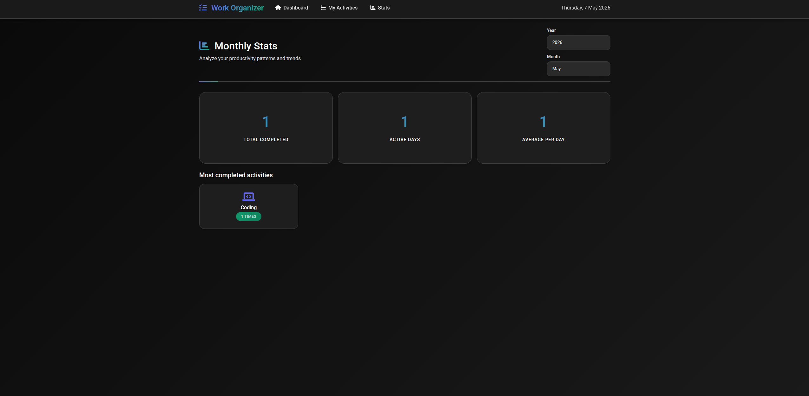

# Work Organizer • Daily Activity Tracker

A beautiful, modern, dark-themed web application to track your daily productivity and habits.

## 🚀 Features
- **Modern Dark UI**: Immersive dark theme with smooth animations.
- **Responsive Design**: Works perfectly on mobile, tablet, and desktop (including large screens).
- **Daily Progress**: Real-time progress tracking for your current day.
- **Activity Management**: Add, edit, delete, and search through your activities.
- **Stats Dashboard**: Analyze your productivity patterns with monthly and yearly statistics.

### Screenshots
| Dashboard | My Activities | Stats Analysis |
| :---: | :---: | :---: |
|  |  |  |

## 🛠️ Installation
1. Clone the repository to your local machine or web server.
2. Ensure you have a PHP environment (Apache/Nginx with PHP 8.0+).
3. Place the project in your web root (e.g., `htdocs` or `/var/www/html`).
4. Ensure the server has write permissions for the `/data` and `/logs` directories.
5. Open the project in your browser.

## 📂 Project Structure
- `index.php`: The main frontend interface.
- `api.php`: Backend logic and data handling.
- `style.css`: Custom styling and animations.
- `/data`: Stores activity definitions (`activities.json`).
- `/logs`: Stores daily completion history.

## 📝 License
This project is open-source and available under the MIT License.

## 🤝 Connect & Support

If you find this tool helpful, consider following my work or supporting the project!

### 📱 Follow Me

  
  
  
  
  
  

### ☕ Support the Project

---
Developed with ❤️ by **Tech Discovery Apps**
